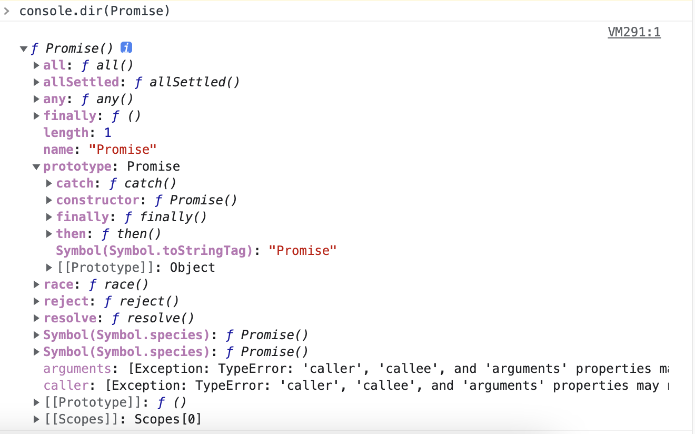

# Promise

## 一、什么是Promise

通过打印Promise可以看到其是一个构造函数，自身带有多种方法

Promise是[Es6](https://so.csdn.net/so/search?q=Es6&spm=1001.2101.3001.7020)新增的构造器，用来提优化异步代码的写法，Promise中文意为承诺，承诺它一段时间后返回给你最终的结果。

## 二、Promise如何运作

Promise存在三种状态：`pending`（进行中）、`fulfilled`（成功）和`reject`（失败），当 Promise 被调用后，它会以处理中状态 (pending) 开始。 这意味着调用的函数会继续执行，而 promise 仍处于处理中直到解决为止，从而为调用的函数提供所请求的任何数据。

被创建的 Promise 最终会以被解决状态 (fulfilled) 或 被拒绝状态 (rejected) 结束，并在完成时调用相应的回调函数（传给 then 和 catch）。

```js
/*
 * @Description: 
 * @Author: xiuji
 * @Date: 2022-11-14 10:05:13
 * @LastEditTime: 2022-11-14 19:36:31
 * @LastEditors: Do not edit
 */
const p = new Promise((resolve, reject) => {
    setTimeout(() => {
        resolve('4秒后兑现承诺')
    }, 4000);
})

const p1 = new Promise((resolve, reject) => {
    setTimeout(() => {
        reject('无法兑现承诺')
    }, 3000);
})

p.then(res => console.log(res)) // 4秒后兑现承诺
p1.catch(err => console.log(err)).finally(() => console.log('finally')); //无法兑现承诺     finally
```

- 执行了`resolve`，Promise状态会变成`fulfilled`，即 **已完成状态**

- 执行了`reject`，Promise状态会变成`rejected`，即 **被拒绝状态**

- Promise只以`第一次为准`，第一次成功就`永久`为`fulfilled`，第一次失败就永远状态为`rejected`,状态不可逆

- 无论Promise最后状态如何都会执行的方法，在ES2018引入。

  finally()不接受任何参数，在finally里的方法与状态无关，finally本质上是then的特例。如果不使用finally，相当于在then和catch的方法里将finally的方法各写一次，即完成状态/拒绝状态后执行的操作

**Promise.then**

1. then 方法返回的也是一个 Promise 对象，并且这个 Promise 对象的状态由 then 内部的回调函数的执行结果来决定，不取决于 then 中执行的是成功的回调还是失败的回调。即：then执行的回调函数的 return 值。

2. then 返回的Promise 对象的状态和回调函数的 return 值之间的关系

   - 如果回调函数的 return 值是**非promise**类型的值 ， 则 then 方法返回的promise对象的状态为成功fulfilled ，状态值为 return 的值。

   ```js
   // 不论是执行.then中成功/失败的回调，return的结果都是非promise类型的值
   // 所以 .then 返回的promise对象的状态都为成功fulfilled
   .then(()=>{
       return 11111;
   })
   ```

   - 如果回调函数没有 return 值，根据 js 中的函数的定义，函数的默认 return 值为 undefined，而 undefined 也是 非promise类型的值，所以结果同上。

   - 如果回调函数的 return 值 是 promise对象 ，则 then 方法返回的promise对象的状态则取决于这个 return 中的 promise对象的内部状态， 内部为resolve, 则 then 返回的状态为fulfilled，内部为reject，则 then 返回的状态为rejected，状态值为resolve / reject 调用时传入的实参。

**Promise.all**

```js
/*
 * @Description: 
 * @Author: xiuji
 * @Date: 2022-11-14 10:05:13
 * @LastEditTime: 2022-11-15 15:57:00
 * @LastEditors: Do not edit
 */
const p = new Promise((resolve, reject) => {
    setTimeout(() => {
        resolve('异步任务1=======>4秒后兑现承诺')
    }, 4000);
})

const p1 = new Promise((resolve, reject) => {
    setTimeout(() => {
        resolve('异步任务2=======>3秒后兑现承诺')
    }, 3000);
})

const p2 = new Promise((resolve, reject) => {
    setTimeout(() => {
        resolve('异步任务3=======>2秒后兑现承诺')
    }, 2000);
})

Promise.all([p,p1,p2]).then(res => console.log(res))
// [
  '异步任务1=======>4秒后兑现承诺',
  '异步任务2=======>3秒后兑现承诺',
  '异步任务3=======>2秒后兑现承诺'
]
```

- 将多个Promise实例包装为一个新的Promise实例。

  Promise.all()接受一个数组作为参数，p,p1, p2都是Promise实例。

- Promise.all()的状态由p,p1, p2决定，只有p,p1, p2的状态都变成fulfilled，p的状态才会变成fulfilled，此时p,p1, p2的返回值组成一个数组，传递给p的回调函数。

- 只要p,p1, p2之中有一个被rejected，Promise.all()的状态就变成rejected，此时第一个被reject的实例的返回值，会传递给p的回调函数。

**Promise.race**

```js
/*
 * @Description: 
 * @Author: xiuji
 * @Date: 2022-11-14 10:05:13
 * @LastEditTime: 2022-11-15 16:49:50
 * @LastEditors: Do not edit
 */
const p = new Promise((resolve, reject) => {
    setTimeout(() => {
        resolve('异步任务1=======>4秒后兑现承诺')
    }, 4000);
})

const p1 = new Promise((resolve, reject) => {
    setTimeout(() => {
        resolve('异步任务2=======>3秒后兑现承诺')
    }, 3000);
})

const p2 = new Promise((resolve, reject) => {
    setTimeout(() => {
        resolve('异步任务3=======>2秒后兑现承诺')
    }, 2000);
})

Promise.race([p,p1,p2]).then(res => console.log(res))
// 异步任务3=======>2秒后兑现承诺
```

- race()与all方法参数一致，但是race只要p,p1, p2之中有一个实例率先改变状态（无论状态为fulfilled/rejected），Promise.all()的状态就跟着改变。那个率先改变的 Promise 实例的返回值，就传递给Promise.all()的回调函数。

**Promise.resolve()**

- **参数是一个 Promise 实例**

参数是 Promise 实例，`Promise.resolve`将不做任何修改、原封不动地返回这个实例

- **参数是一个`thenable`对象**

如果`resolve`中传入的是一个对象，并且这个对象有实现`then`方法，那么会执行该`then`方法，`then`方法会传入`resolve`，`reject`函数。此时的`promise`状态取决于你调用了`resolve`，还是`reject`函数。这种模式也称之为: **thenable**

```js
const p = new Promise((resolve, reject) => {
  resolve({
    then(res, rej) {
      res('hi thenable')
    }
  })
})

p.then(res => console.log(res))

// hi thenable
```

- **参数不是具有`then`方法的对象，或根本就不是对象**

参数是一个原始值，或者是一个不具有`then`方法的对象，则`Promise.resolve`方法返回一个新的 Promise 对象，状态为`resolved`。

**Promise.reject()**

Promise.reject(reason)方法会返回一个新的 Promise 实例，该实例的状态为rejected。

```js
const p = Promise.reject('出错了');
// 等同于
const p = new Promise((resolve, reject) => reject('出错了'))

p.then(null, function (s) {
  console.log(s)
});
// 出错了
```

## 三、Promise存在的意义

1. 众所周知js执行是从上往下同步执行，当异步程序运行未结束时，下面程序全都会被异步操作阻塞，运用Promise可以完美解决js的同步阻塞。
2. 回调地狱，业务场景中经常需要将一个接口中的返回值作为下一个接口的入参，当这样的步骤变多时，函数一层套一层便会产生回调地狱；这样的代码可读性可维护性都很差，举个栗子：

```js
setTimeout(function () {  //第一层
            console.log(111);
            setTimeout(function () {  //第二层
                console.log(222);
                setTimeout(function () {   //第三层
                    console.log(333);
                }, 1000)
            }, 2000)
        }, 3000)
```

运用Promise可以增加多层嵌套时代码的可读性和可维护性,再举个栗子：

```js
/*
 * @Description: 
 * @Author: xiuji
 * @Date: 2022-11-14 10:05:13
 * @LastEditTime: 2022-11-15 20:09:59
 * @LastEditors: Do not edit
 */
const getData = url => {
    return new Promise((resolve, reject) => {
        // 模拟调用接口获取参数
        setTimeout(() => {
            if (url.includes('/api/test')) {
                resolve(url)
            }
            reject('请求错误')
        }, 2000);
    })
}

getData('/api/test').then(res => {
    getData(`${res}/test1`).then(res => {
        getData(`${res}/test2`).then(res => console.log(res))
    })
})
// 上面的写法依然不够优雅，可以优化如下
getData('/api/test').then(res => {
    return getData(`${res}/test1`)
}).then(res => {
    return getData(`${res}/test2`)
}).then(res => console.log(res, '优化后'))
// 最终解决回调地狱的办法 promise配合async/await使用
async function getUrlData() {
    const res = await getData('/api/test')
    const res1 = await getData(`${res}/test1`)
    const res2 = await getData(`${res1}/test2`)
    console.log(res2,'最终');
}
getUrlData()
```

**Promise 存在的意义是异步问题同步化解决方案**

