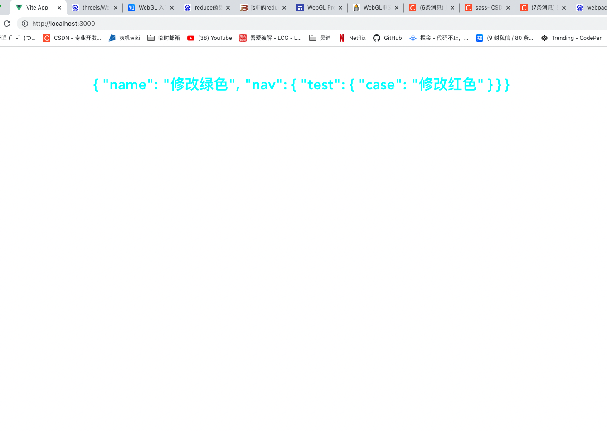
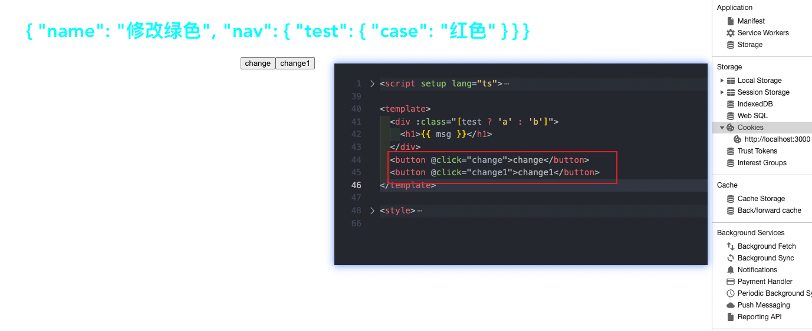

## reactive全家桶

用来绑定复杂的数据类型 例如 对象 数组

```ts
let arr = reactive<number[]>([]) // reactive方法需要传入复杂数据类型，[],{}
let obj = reactive({ name: '绿色' })
obj.name = '蓝色'

// 数组赋值
setTimeout(() => {
  let test = [1, 2, 3, 4]
  arr.push(...test)
  console.log(...test);
}, 1000);
```

`shallowReactvie`

只修改浅层次对象的属性，不修改深层次对象属性

```ts
let msg = shallowReactive({
  name: '绿色',
  nav: {
    test: {
      case: '红色'
    }
  }
})

const change = () => {
  msg.name = '修改绿色'
}

const change1 = () => {
  msg.nav.test.case = '修改红色'
}
change()
change1()
```

这个方法只适用于修改dom挂载之后的对象属性



`change`方法在dom完全挂载结束后触发



注：使用`shallowReactive`方法要注意生命周期
