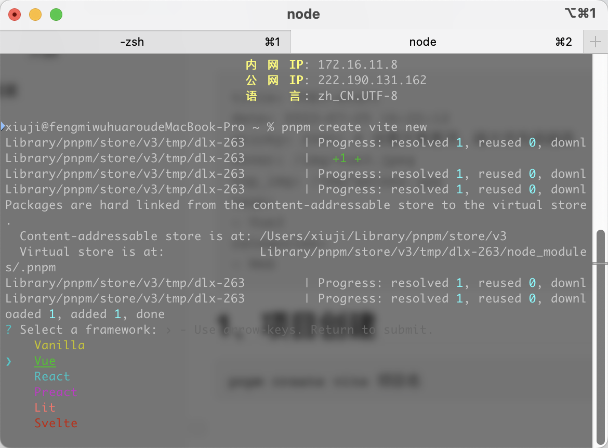
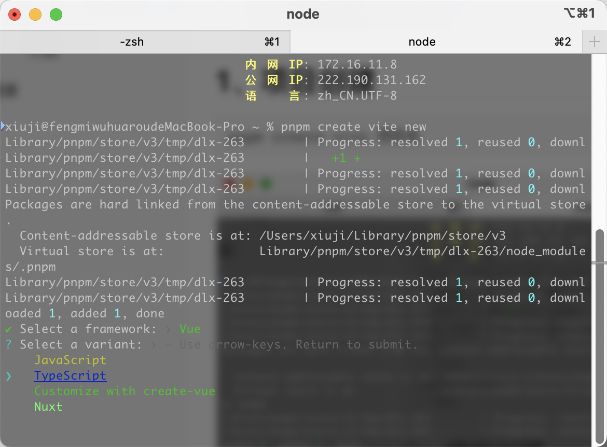
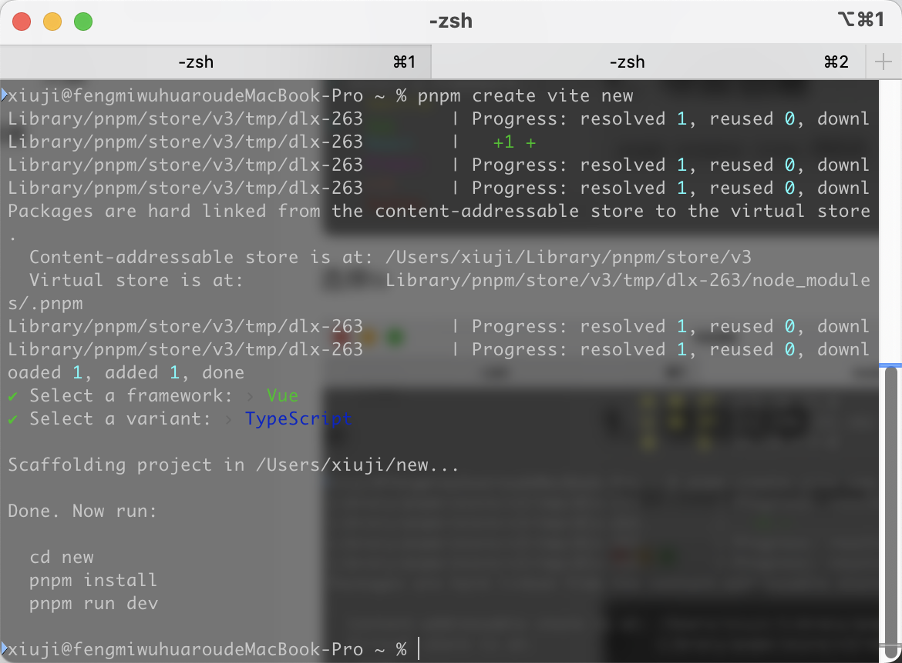
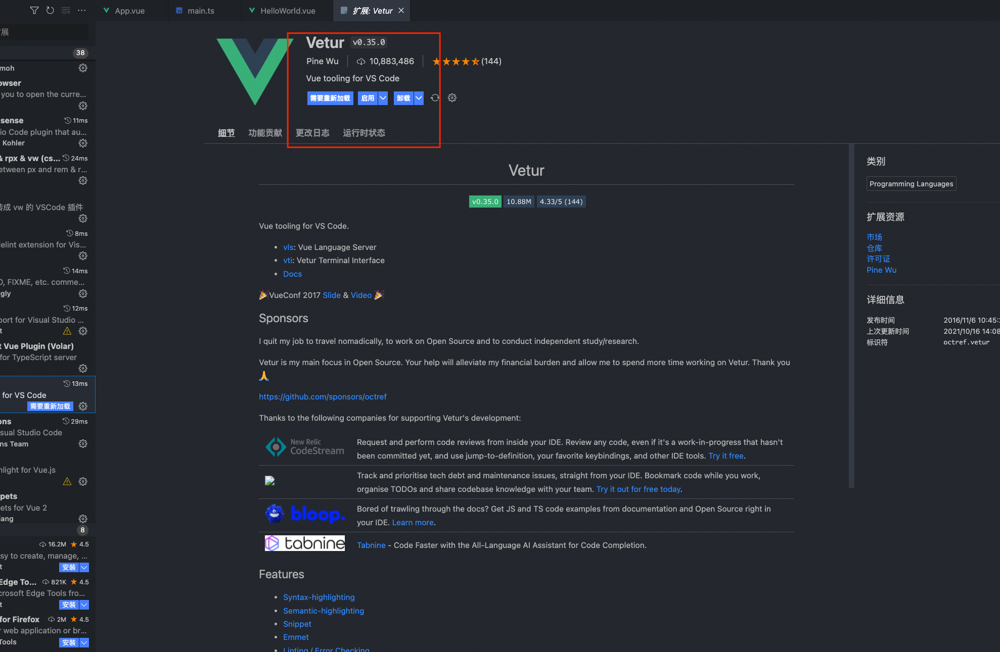
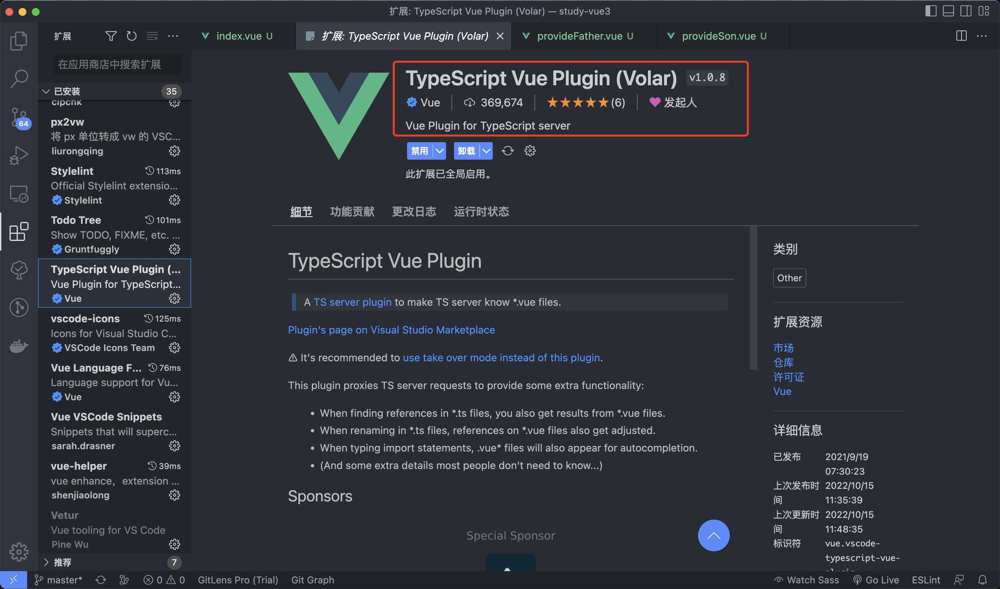

## 1、项目创建

```bash
pnpm create vite 项目名 
```

选择vue

#### 

选择ts



项目创建完成



进入项目文件夹，运行pnpm install安装依赖，通过pnpm run dev运行项目

## 2、Vscode插件调整



vetur语法提示适配vue2.X，写vue3时应该禁用

推荐使用Volar，完美适配Vue3语法


