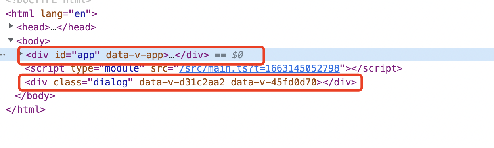

## Teleport传送组件

`Teleport` Vue 3.0新特性之一。

`Teleport` 是一种能够将我们的模板渲染至指定DOM节点，不受父级style、v-show等属性影响，但data、prop数据依旧能够共用的技术；类似于 React 的 `Portal`。

主要解决的问题 因为`Teleport`节点挂载在其他指定的DOM节点下，完全不受父级style样式影响。

定义一个绝对定位的弹出框，倘若父元素中有`position:relative`属性，该弹出层的位置会相对于父元素改变

```vue
<!--
 * @Description: 
 * @Author: xiuji
 * @Date: 2022-09-14 16:38:57
 * @LastEditTime: 2022-09-14 16:40:32
 * @LastEditors: Do not edit
-->
<template>
    <div class="dialog">
    </div>
</template>

<script setup lang="ts">
</script>

<style scoped lang="scss">
.dialog {
    width: 400px;
    height: 400px;
    background-color: aqua;
    position: absolute;
    top: 50%;
    left: 50%;
    margin-left: -200px;
    margin-top: -200px;
}
</style>
```

使用`teleprot`传送组件能使该弹出层组件不受父级style样式影响，可通过to属性自定义传送位置，支持class，id，标签等选择器

```vue
<!--
 * @Description: 
 * @Author: xiuji
 * @Date: 2022-08-31 21:14:30
 * @LastEditTime: 2022-09-14 16:43:48
 * @LastEditors: Do not edit
-->
<template>
  <div class="content">
    <!-- 动态控制teleport
使用disabled 设置为 true则 to属性不生效  false 则生效 -->
    <teleport :false="false" to="body">
      <Tel></Tel>
    </teleport>
  </div>
</template>

<script setup lang="ts">
import Tel from './components/teleportCom.vue'
</script>

<style lang="scss" scoped>
.content {
  position: relative;
  flex: 1;
  height: 100%;
  margin: 20px;
  border: 1px solid #ccc;
  overflow: auto;

  &-tabs {
    display: flex;

    &-box {
      padding: 10px;
      border: 1px solid #ccc;
    }
  }

  &-box {
    padding: 10px;
    border: 1px solid #ccc;
  }
}
</style>
```

子组件传送至body标签内，与app同级



##### 
