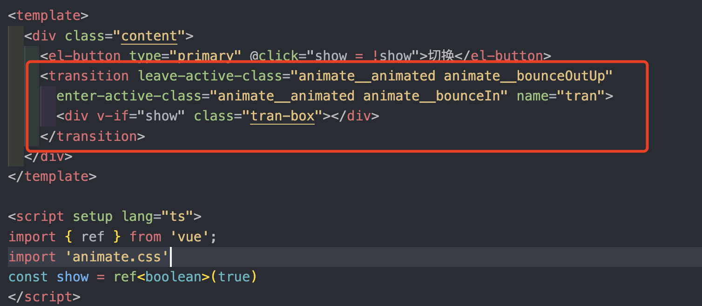

## transition动画组件

Vue 提供了 `transition` 的封装组件，在下列情形中，可以给任何元素和组件添加进入/离开过渡:

- 条件渲染 (使用 v-if)
- 条件展示 (使用 v-show)
- 动态组件
- 组件根节点

### 1、 自定义transtions动画组件过度效果

自定义 transition 过度效果，你需要对`transition`组件的`name`属性自定义。并在css中写入对应的样式

```vue
<!--
 * @Description: 
 * @Author: xiuji
 * @Date: 2022-08-31 21:14:30
 * @LastEditTime: 2022-09-15 16:01:53
 * @LastEditors: Do not edit
-->
<template>
  <div class="content">
    <el-button type="primary" @click="show = !show">切换			</el-button>
    <!-- transition中必须定义name属性，用于在style标签中定义对应样式 -->
    <transition name="tran">
      <div v-if="show" class="tran-box"></div>
    </transition>
  </div>
</template>

<script setup lang="ts">
import { ref } from 'vue';
const show = ref<boolean>(true)
</script>

<style lang="scss" scoped>
.content {
  position: relative;
  flex: 1;
  height: 100%;
  margin: 20px;
  border: 1px solid #ccc;
  overflow: auto;

  &-tabs {
    display: flex;

    &-box {
      padding: 10px;
      border: 1px solid #ccc;
    }
  }

  &-box {
    padding: 10px;
    border: 1px solid #ccc;
  }

  .tran-box {
    width: 200px;
    height: 200px;
    background-color: yellowgreen;
  }

  // 开始的过度
  .tran-enter-from {
    width: 0;
    height: 0;
  }

  // 开始过度了
  .tran-enter-active {
    transition: all 1s linear;
  }

  // 过度完成
  .tran-enter-to {
    width: 200px;
    height: 200px;
    transform: rotate(180deg);
    background-color: yellowgreen;
  }

  // 离开的过度
  .tran-leave-from {
    width: 200px;
    height: 200px;
    transform: rotateX(180deg);
    background-color: yellowgreen;
  }

  // 离开中过度
  .tran-leave-active {
    transition: all 1s ease;
  }

  // 离开完成
  .tran-leave-to {
    width: 0;
    height: 0;
  }
}
</style>
```

### 2、 通过props属性自定义样式

也可以在transition组件上通过组件`props`属性传入自定义类名，props属性名如下：

- `enter-from-class`
- `enter-active-class`
- `enter-to-class`
- `leave-from-class`
- `leave-active-class`
- `leave-to-class`

通过`props`属性名可与第三方库结合使用，比如css动画库[animate css](https://animate.style/)



### 3、 自定义过度时间

```vue
<transition :duration="1000">...</transition>
 
 
<transition :duration="{ enter: 500, leave: 800 }">...</transition>
```

### 4、 transition生命周期

```vue
@before-enter="beforeEnter" //对应enter-from
@enter="enter"//对应enter-active
@after-enter="afterEnter"//对应enter-to
@enter-cancelled="enterCancelled"//显示过度打断
@before-leave="beforeLeave"//对应leave-from
@leave="leave"//对应enter-active
@after-leave="afterLeave"//对应leave-to
@leave-cancelled="leaveCancelled"//离开过度打断

const beforeEnter = (el: Element) => {
    console.log('进入之前from', el);
}

const Enter = (el: Element,done:Function) => {
    console.log('过度曲线');
    setTimeout(()=>{
       done()
    },3000)
}

const AfterEnter = (el: Element) => {
    console.log('to');
}
```

通过transtions动画组件生命周期结合[GreenSock](https://greensock.com/)动画库使用

```vue
<!--
 * @Description: 
 * @Author: xiuji
 * @Date: 2022-08-31 21:14:30
 * @LastEditTime: 2022-10-07 14:58:49
 * @LastEditors: Do not edit
-->
<template>
  <div class="content">
    <el-button type="primary" @click="show = !show">切换</el-button>
    <transition @before-enter="beforeEnter" @enter="enterActive" @leave="leave">
      <div v-if="show" class="tran-box"></div>
    </transition>
  </div>
</template>

<script setup lang="ts">
import { ref } from 'vue';
import gsap from 'gsap'
const show = ref<boolean>(true)

const beforeEnter = (el: Element) => {
  gsap.set(el, {
    width: 0,
    height: 0
  })
}

const enterActive = (el: Element, done: GSAPCallback) => {
  gsap.to(el, {
    width: 200,
    height: 200,
    onComplete: done
  })
}

const leave = (el: Element, done: GSAPCallback) => {
  gsap.to(el, {
    width: 0,
    height: 0,
    onComplete: done
  })
}
</script>
```

### 5、 appear

通过appear属性可以设置初始节点过渡，就是页面加载完成就动画效果就开始，加载对应三个状态，该属性也可与`animate.css`动画库结合使用。
**注意：**仅仅是页面初始化时的加载动画，后续操作元素可用生命周期调整动画

```vue
<transition appear appear-active-class="animate__animated animate__bounce">
  <div v-if="show" class="tran-box"></div>
</transition>
```

#### 
