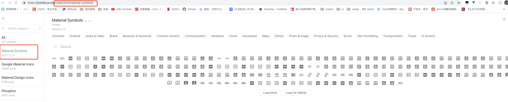

# 什么是css原子化

CSS原子化的优缺点

1. 减少了css体积，提高了css复用
2. 减少了起名的复杂度
3. 增加了记忆成本，将css拆分为原子后，开发者必须记住一些class才能书写，即使类似tailwindcss提供了完善的工具链，开发者写background，也要记住开头是bg

# 项目接入unocss

**tips：最好用于vite项目中，webpack搭建的项目中unocss属于阉割版功能很少**

安装

```bash
pnpm i -D unocss
```

vite.config.ts

```ts
/*
 * @Description: 
 * @Author: xiuji
 * @Date: 2022-07-12 16:30:05
 * @LastEditTime: 2023-01-10 14:00:09
 * @LastEditors: Do not edit
 */
import { defineConfig } from 'vite'
import vue from '@vitejs/plugin-vue'
import vueJsx from '@vitejs/plugin-vue-jsx';
import AutoImport from 'unplugin-auto-import/vite'
import Components from 'unplugin-vue-components/vite'
import { ElementPlusResolver } from 'unplugin-vue-components/resolvers'
import unocss from 'unocss/vite'

// https://vitejs.dev/config/
export default defineConfig({
  plugins: [
    vue(),
    vueJsx(),
    AutoImport({
      resolvers: [ElementPlusResolver()],
    }),
    Components({
      resolvers: [ElementPlusResolver()],
    }),
    unocss({
      rules: []
    })]
})

```

main.ts引入

```ts
import 'unocss'
```

配置静态css

```ts
rules: [
  ['test', { color: 'pink' }] // 二维数组定义需要的样式
]
```

全局任意组件内使用class类名test都可生效


使用正则表达式配置动态css

```ts
rules: [
  [/^m-(\d+)$/, ([, d]) => ({ margin: `${Number(d) * 10}px` })] // m-参数*10   例如 m-10 就是 margin:100px
]
```

shortcuts可以自定义组合样式

```ts
  plugins: [vue(), vueJsx(), unocss({
    rules: [
      [/^m-(\d+)$/, ([, d]) => ({ margin: `${Number(d) * 10}px` })],
      ['flex', { display: "flex" }],
      ['test', { color: 'pink' }]
    ],
    shortcuts: {
      btn: "test flex"
    }
  })],
```

unocss预设

```ts
import { presetIcons, presetAttributify, presetUno } from 'unocss'

export default defineConfig({
  plugins: [
    vue(),
    vueJsx(),
    AutoImport({
      resolvers: [ElementPlusResolver()],
    }),
    Components({
      resolvers: [ElementPlusResolver()],
    }),
    unocss({
      presets: [presetIcons(), presetAttributify(), presetUno()], // 使用预设，都是函数
      rules: [
        ['test', { color: 'pink' }], // 二维数组定义需要的样式
        ['font', { color: 'yellowgreen' }]
      ]
    })],
  resolve: {
    alias: {
      '@': '/src' // @指定相对路径
    }
  }
})
```

- presetIcons Icon图标预设

  图标集合安装，首先去[icones官网](https://icones.js.org/)选择一套需要的icon

  看清url后缀，安装对应的图标库

  ```bash
  pnpm i -D @iconify-json/material-symbols
  ```

  标签中直接使用类名即可

- presetAttributify 属性化模式支持

  属性语义化，无需class样式即可生效

  ```html
  <div font>
       btn
  </div>
  ```

- presetUno 工具类预设

  默认的 @unocss/preset-uno 预设（实验阶段）是一系列流行的原子化框架的 通用超集，包括了 Tailwind CSS，Windi CSS，Bootstrap，Tachyons 等。

  例如，ml-3（Tailwind），ms-2（Bootstrap），ma4（Tachyons），mt-10px（Windi CSS）均会生效。
