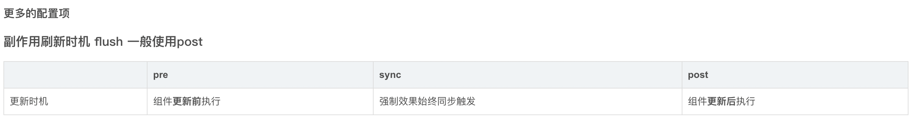

## watchEffect高级监听属性

立即执行传入的一个函数，同时响应式追踪其依赖，并在其依赖变更时重新运行该函数。

如果用到message 就只会监听message 就是用到几个监听几个 而且是非惰性 会默认调用一次

```ts
let msg = ref<string>('飞机')
let msg1 = ref<string>('火车')

watchEffect(() => {
  
  console.log('选择监听', msg.value);

  console.log('选择监听', msg1.value); // 明示具体监听哪个属性
})
```

清除副作用：在触发监听之前会调用一个可以处理业务逻辑的函数，例如防抖

```ts
watchEffect((test) => {
  test(() => {
    console.log('清除副作用')
  })
  console.log('选择监听', msg.value);
  console.log('选择监听', msg1.value); // 明示具体监听哪个属性
})
```

***watchEffect***返回一个停止监听的函数，可用于停止监听

```ts
const stop = watchEffect ((test) => {
  test = () => {
    console.log('清除副作用')
  }
  console.log('选择监听', msg.value);
  console.log('选择监听', msg1.value); // 明示具体监听哪个属性
})

const stopWatch = () => stop() // 调用该方法可停止监听属性
```

```ts
const stop = watchEffect((test) => {
  test(() => {
    console.log(1);
  })
  console.log('选择监听', msg.value);
  console.log('选择监听', msg1.value);
},
  {
    flush: 'post',
    onTrigger() { // onTrigger可以用来调试watchEffect
      debugger
    }
  })
```


