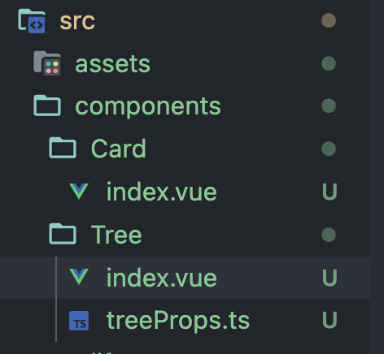
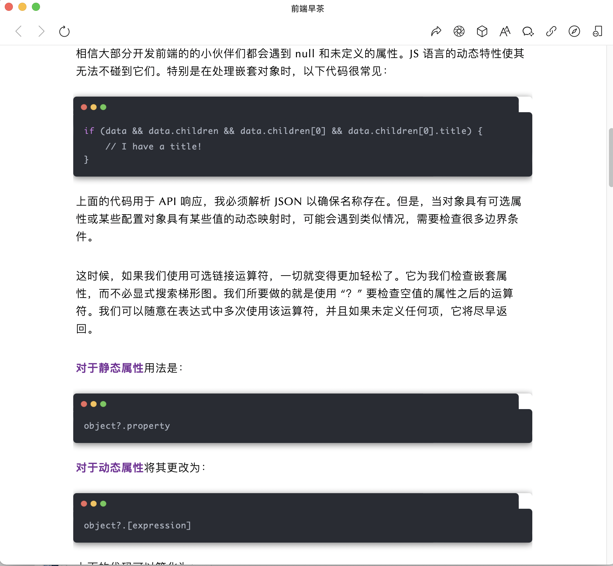

## 全局组件、局部组件，递归组件

### 1、 全局组件

components下创建组件



main.ts中引入组件并将组件注册在vue实例上

```ts
import Card from './components/Card/index.vue'
// 全局组件注册应该绑定在mount之前
createApp(App).component('Card', Card).mount('#app')
```

### 2、 局部组件

vue3中局部组件引用方式与vue2相同

### 3、 递归组件

本质是自己调用自己，到达限定条件后结束

```vue
<template>
    <div class="tree">
        <div v-for="(i, k) in data" :key="k" class="tree-	box" @click.stop="clickItem(i)">
            {{ i.name }}
            <!-- i?.children?.length -->
            <Tree @on-click="clickItem" v-if="i?.children?.length" :data="i.children"></Tree>
        </div>
    </div>
</template>

<script setup lang="ts">
import { treeList } from './treeProps';
import Tree from './index.vue'
type Props = {
    data?: treeList[]
}
defineProps<Props>()
const emit = defineEmits(['on-click'])
const clickItem = (i: treeList) => {
    emit('on-click', i)
}
</script>

<style lang="scss" scoped>
.tree {
    &-box {
        cursor: pointer;
        margin-left: 10px;
    }
}
</style>
```

**i?.children?.length**，**可选链操作符**判断i是否为null或undefined，否=>，判断i.children是否为null或undefined，否=>

```ts
const item = {
  name:''
}
console.log(item.children) // undefined

console.log(item.children.length) 
// 控制台报错 Uncaught TypeError: Cannot read properties of undefined (reading 'length')
    at <anonymous>:1:27

console.log(item.children?.length) // undefined

item?.children?.length ?? [] // []
// 左侧undefined或null ?? [] ，输出的都是右侧内容;左侧为0或false不会输出右侧内容
```



可选链操作符可参考下文：

[https://developer.mozilla.org/zh-CN/docs/Web/JavaScript/Reference/Operators/Optional_chaining]: 
[https://mp.weixin.qq.com/s/LUvuYpOmr4AFSQSsKWPzFQ]: 
