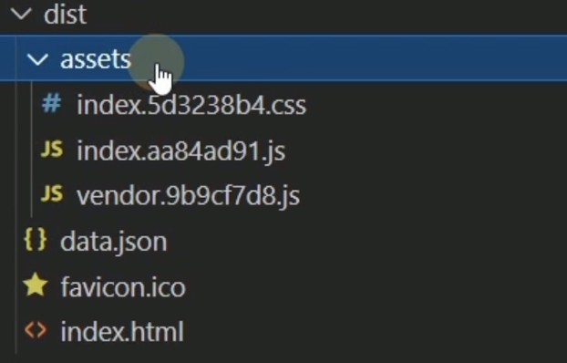
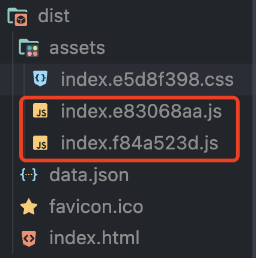

## 异步组件、代码分包、suspense

vue项目打包后生成dist文件，**第三方依赖会集成在vendor.js文件中**，**应用自身的内容会集成在index.js文件中**，大型应用index.js文件会随着业务的拓展越来越大，目前SPA单页应用常见的首屏加载白屏与此有很大关系。



通过异步组件将大型应用分割成小一些的代码块，并且减少主包的体积，完成性能优化，能够优化首页加载速度。使用异步组件后打包构建的dist文件如下：



应用被拆分成不同的index文件。

### 使用异步组件

子组件中数据来自于请求后台服务获取的异步数据

```vue
<!--
 * @Description: 
 * @Author: xiuji
 * @Date: 2022-09-14 15:20:50
 * @LastEditTime: 2022-09-14 15:44:32
 * @LastEditors: Do not edit
-->
<template>
    <div>
        <div v-for="(i,k) in list" :key="k">
            {{ i.name }}
        </div>
    </div>
</template>

<script setup lang="ts">
import { axios } from './server';
// vue3setup语法糖中可以直接使用await
const list = await axios('/public/data.json')
console.log(list, 'list');
</script>
```

父组件使用defineAsyncComponent和suspense实现组件的异步加载。

```vue
<!--
 * @Description: 
 * @Author: xiuji
 * @Date: 2022-08-31 21:14:30
 * @LastEditTime: 2022-09-14 15:45:11
 * @LastEditors: Do not edit
-->
<template>
  <div class="content">
    <suspense>
      <template #default> // 组件加载完成时显示
        <A></A>
      </template>
      <template #fallback> // 组件正在加载时可以在这里做些什么
        loading...
      </template>
    </suspense>
  </div>
</template>

<script setup lang="ts">
import { defineAsyncComponent } from 'vue';
// import A from '../../components/asyncCom/index.vue'此种import引入方式只允许在顶层使用
  
// defineAsyncComponent方法接收一个工厂函数作为参数，工厂函数返回一个Promise对象，在defineAsyncComponent中通过import函数方式引入子组件
const A = defineAsyncComponent(() => import('../../components/asyncCom/index.vue')) // build时遇到import函数形式会把这部分逻辑拆分出去，构建成一个单独的js包
</script>

<style lang="scss" scoped>
.content {
  flex: 1;
  height: 100%;
  margin: 20px;
  border: 1px solid #ccc;
  overflow: auto;

  &-tabs {
    display: flex;

    &-box {
      padding: 10px;
      border: 1px solid #ccc;
    }
  }

  &-box {
    padding: 10px;
    border: 1px solid #ccc;
  }
}
</style>
```

#### 
