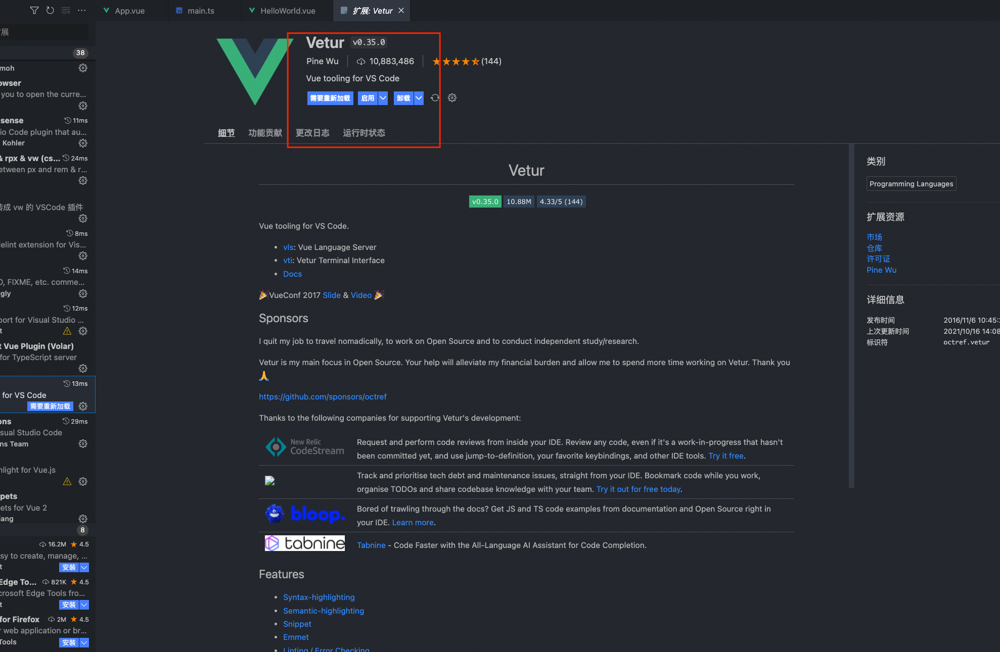
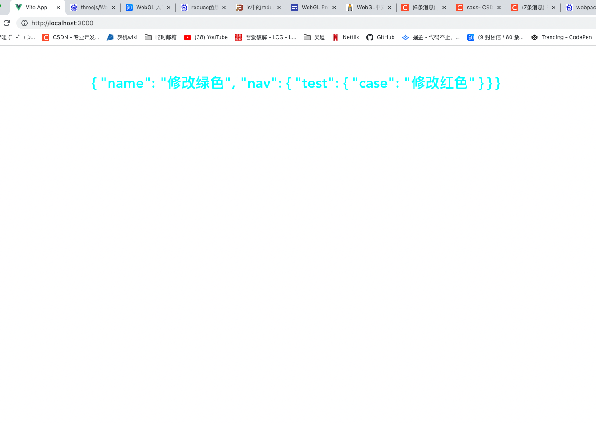
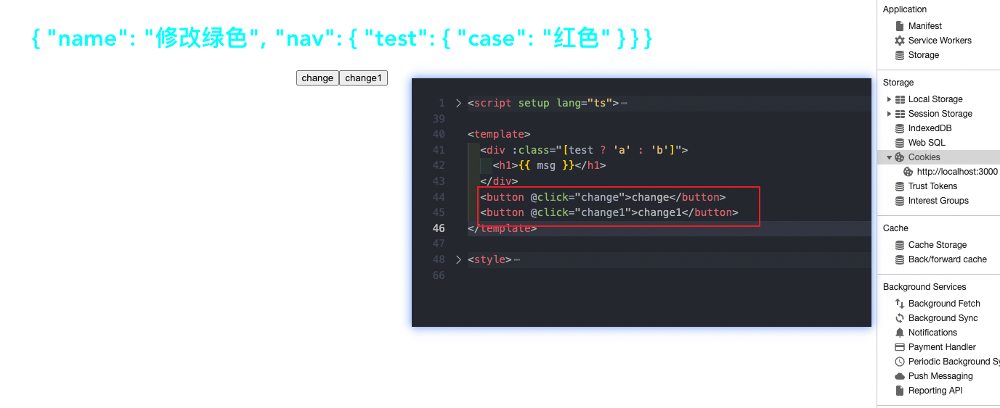
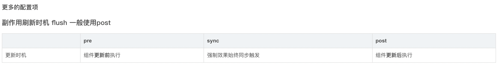
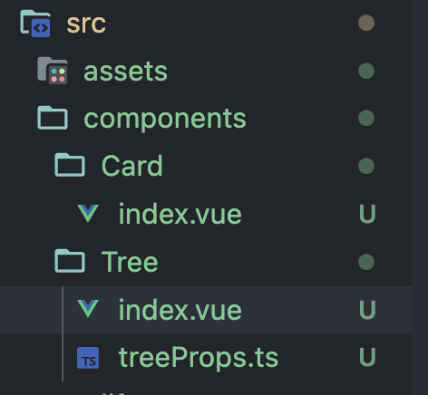
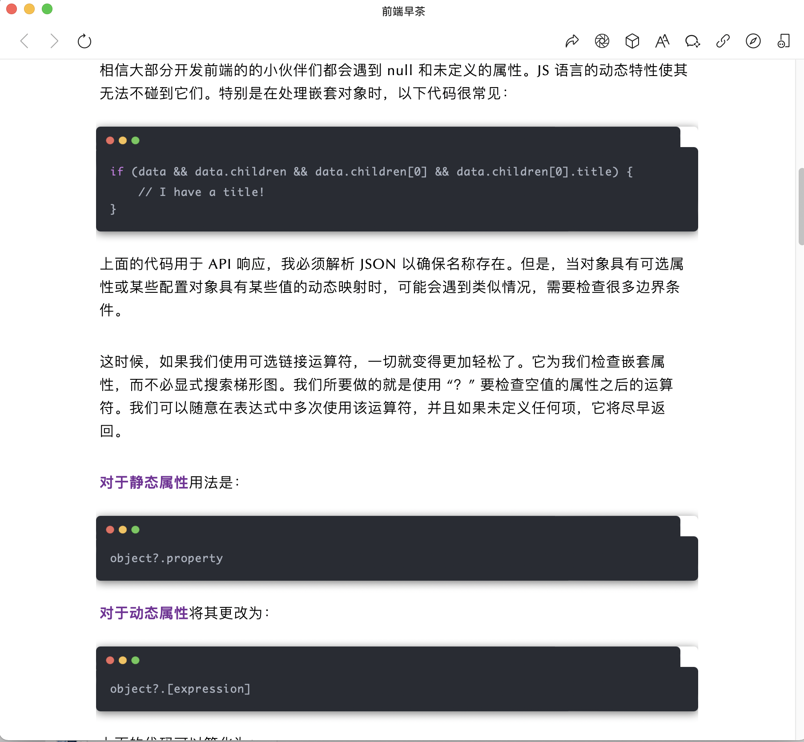
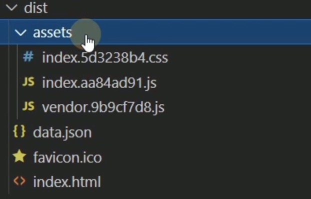
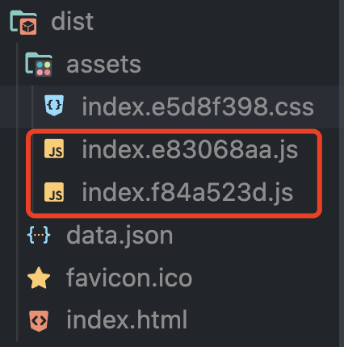
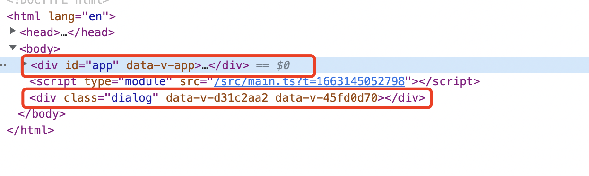
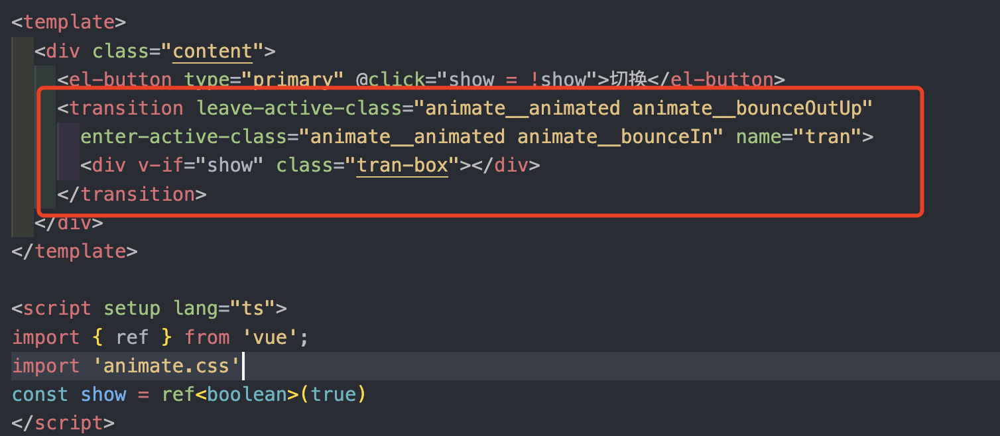

---

## 一、准备工作

#### 1、创建项目

```bash
pnpm create vite 项目名 
```

#### 2、Vscode插件调整



vetur语法提示适配vue2.X，写vue3时应该禁用

## 二、vue3语法

#### 1、ref全家桶

vue3通过ref将view中的数据绑定为响应式数据

1、Ref,ref

被ref包装之后需要.value 来进行赋值

```ts
import { ref, Ref } from 'vue'
写法1
let msg = ref<string>('红色')
const change = () => {
   msg.value = '绿色'
   console.log(msg);
}
写法2 Ref范型
let msg: Ref<string> = ref('大红色')
const change = () => {
  msg.value = '大绿色'
  console.log(msg);
}
```

2、isRef

判断是不是一个ref对象

```ts
let msg: Ref<string | number> = ref('大红色')
let num: number = 123
const change = () => {
  msg.value = '大绿色'
  console.log(isRef(msg)); // true
  console.log(isRef(num)); // false
}
```

3、shallowRef和triggerRef

创建一个跟踪自身.value变化的ref，但不会使其指也变成响应式的,可以和triggerRef配合使用，节省性能

triggerRef强制更新页面DOM

```ts
let msg = shallowRef({
  name: '红色'
})

const change = () => {
  msg.value.name = '绿色'
  triggerRef(msg)
}
```

4、customRef

`customRef` 是个工厂函数要求我们返回一个对象 并且实现 get 和 set

```ts
function myRef<T>(value: T) {
  return customRef((track, trigger) => {
    return {
      get() {
        track()
        return value
      },
      set(newVal: T) {
        console.log('set');
        value = newVal
        trigger()
      }
    }
  })
}
let msg = myRef('红色')
const change = () => {
  msg.value = '绿色'
}
```

#### 2、reactive全家桶

用来绑定复杂的数据类型 例如 对象 数组

```ts
let arr = reactive<number[]>([]) // reactive方法需要传入复杂数据类型，[],{}
let obj = reactive({ name: '绿色' })
obj.name = '蓝色'

// 数组赋值
setTimeout(() => {
  let test = [1, 2, 3, 4]
  arr.push(...test)
  console.log(...test);
}, 1000);
```

`shallowReactvie`

只修改浅层次对象的属性，不修改深层次对象属性

```ts
let msg = shallowReactive({
  name: '绿色',
  nav: {
    test: {
      case: '红色'
    }
  }
})

const change = () => {
  msg.name = '修改绿色'
}

const change1 = () => {
  msg.nav.test.case = '修改红色'
}
change()
change1()
```

这个方法只适用于修改dom挂载之后的对象属性



`change`方法在dom完全挂载结束后触发



注：使用`shallowReactive`方法要注意生命周期

#### 3、to全家桶

 `toRef`将原始对象中的属性转化为响应式的

```ts
const obj = {
  foo: 1,
  doo: 2
}

const state = toRef(obj, 'foo')

const change = () => {
  state.value++
  console.log('-----原始对象', obj);
  console.log('-----引用对象', state);
}
```

`toRefs`可以帮我们批量创建ref对象主要是方便我们解构使用

```ts
const obj = reactive({
  foo: 1,
  doo: 2
})

let { foo, doo } = toRefs(obj)

const change = () => {
  foo.value++
  doo.value++
  console.log('-----响应式对象', obj);
}
```

`toRaw`将响应式对象转为普通对象

#### 4、computed计算属性

当依赖的属性的值发生变化的时候，才会触发他的更改，如果依赖的值，不发生变化的时候，使用的是缓存中的属性值 

```ts
let $total = ref<number>(0) //定义一个number类型的响应式数据，默认值为0

$total = computed<number>(() => { // computed返回值为number类型
  return obj.reduce((prev, next) => {
    return prev + (next.num * next.price)
  }, 0)
})
```

#### 5、watch监听属性

`watch`一共三个参数

第一个参数：监听的数据源；

```ts
let st = ref({
  nav: {
    tag: {
      name: 'test'
    }
  }
})

watch(st,(newVal,oldVal) => { // 第一个参数可为数组，同时监听多个参数
  console.log('新的', newVal);
  console.log('旧的', oldVal);
})
```

第二个参数：回调函数（newVal,oldVal）newVal变化后的数据，oldVal变化前的数据；

第三个参数：

```ts
{
	immediate:true, // 是否立刻调用一次
  deep:true // 是否开启深度监听
}
```

监听复杂数据类型的响应式数据

```vue
<input type="text" v-model="msg.name">
<input type="text" v-model="msg.foot">

let msg = reactive({
  name: '小汪',
  foot: '鞋子'
})

watch(msg,(newVal,oldVal) => {
  console.log('新的', newVal);
  console.log('旧的', oldVal);
})

// 监听复杂数据类型中的单一属性,第一个参数传入一个回调，回调中返回要监听的属性
watch(() => msg.name,(newVal,oldVal) => {
  console.log('新的', newVal);
  console.log('旧的', oldVal);
})
```

#### 6、watchEffect高级监听属性

立即执行传入的一个函数，同时响应式追踪其依赖，并在其依赖变更时重新运行该函数。

如果用到message 就只会监听message 就是用到几个监听几个 而且是非惰性 会默认调用一次

```ts
let msg = ref<string>('飞机')
let msg1 = ref<string>('火车')

watchEffect(() => {
  
  console.log('选择监听', msg.value);

  console.log('选择监听', msg1.value); // 明示具体监听哪个属性
})
```

清除副作用：在触发监听之前会调用一个可以处理业务逻辑的函数，例如防抖

```ts
watchEffect((test) => {
  test(() => {
    console.log('清除副作用')
  })
  console.log('选择监听', msg.value);
  console.log('选择监听', msg1.value); // 明示具体监听哪个属性
})
```

***watchEffect***返回一个停止监听的函数，可用于停止监听

```ts
const stop = watchEffect ((test) => {
  test = () => {
    console.log('清除副作用')
  }
  console.log('选择监听', msg.value);
  console.log('选择监听', msg1.value); // 明示具体监听哪个属性
})

const stopWatch = () => stop() // 调用该方法可停止监听属性
```

```ts
const stop = watchEffect((test) => {
  test(() => {
    console.log(1);
  })
  console.log('选择监听', msg.value);
  console.log('选择监听', msg1.value);
},
  {
    flush: 'post',
    onTrigger() { // onTrigger可以用来调试watchEffect
      debugger
    }
  })
```



#### 7、生命周期

```ts
onBeforeMount, // 创建之前，获取不到dom元素
onMounted, // dom元素渲染完成
onBeforeUpdate, // 更新之前
onUpdated, // 更新之后
onBeforeUnmount, // 卸载之前
onUnmounted, // 卸载完成
```

#### 8、父子组件传参

`defineProps`  默认接收父组件传过来的参数

```ts
type Props = {
  name:string,
  content:string
}
defineProps<Props>() // 范型中定义的属性可以直接在子组件中使用
```

`withDefault`方法定义默认props参数,withDefault方法接收两个参数，第一个参数固定defineProps<Props>(),第二个参数是个对象，定义默认参数

```ts
<script setup lang="ts">
  type Props = {
    name?:string,
    content?:string,
    list?: () => [] // 复杂数据类型需要通过函数方式return出去，否则控制台会报错
  }
  withDefault(defineProps<Props>(),{
    name:'我是默认name',
    content:'我是默认content'
  })
</script>
```

`defineEmits`事件派发，子组件向父组件传递参数,子组件中定义事件

```ts
// 子组件
<script setup lang="ts">
  import { ref } from 'vue'
  const data = ref<number>(0)
  const emit = defineEmit(['on-click'])
  emit('on-click',data)
</script>
```

父组件绑定自定义事件并定义接收参数的方法

```vue
<Card @on-click="getItem"></Card>
<script setup lang="ts">
  const getItem = (i) => {
    console.log(i,'来自子组件的参数')
  }
</script>
```

#### 9、全局组件、局部组件，递归组件

###### 9.1 全局组件

components下创建组件



main.ts中引入组件并将组件注册在vue实例上

```ts
import Card from './components/Card/index.vue'
// 全局组件注册应该绑定在mount之前
createApp(App).component('Card', Card).mount('#app')
```

###### 9.2 局部组件

vue3中局部组件引用方式与vue2相同

###### 9.3 递归组件

本质是自己调用自己，到达限定条件后结束

```vue
<template>
    <div class="tree">
        <div v-for="(i, k) in data" :key="k" class="tree-	box" @click.stop="clickItem(i)">
            {{ i.name }}
            <!-- i?.children?.length -->
            <Tree @on-click="clickItem" v-if="i?.children?.length" :data="i.children"></Tree>
        </div>
    </div>
</template>

<script setup lang="ts">
import { treeList } from './treeProps';
import Tree from './index.vue'
type Props = {
    data?: treeList[]
}
defineProps<Props>()
const emit = defineEmits(['on-click'])
const clickItem = (i: treeList) => {
    emit('on-click', i)
}
</script>

<style lang="scss" scoped>
.tree {
    &-box {
        cursor: pointer;
        margin-left: 10px;
    }
}
</style>
```

**i?.children?.length**，**可选链操作符**判断i是否为null或undefined，否=>，判断i.children是否为null或undefined，否=>

```ts
const item = {
  name:''
}
console.log(item.children) // undefined

console.log(item.children.length) 
// 控制台报错 Uncaught TypeError: Cannot read properties of undefined (reading 'length')
    at <anonymous>:1:27

console.log(item.children?.length) // undefined

item?.children?.length ?? [] // []
// 左侧undefined或null ?? [] ，输出的都是右侧内容;左侧为0或false不会输出右侧内容
```



可选链操作符可参考下文：

[https://developer.mozilla.org/zh-CN/docs/Web/JavaScript/Reference/Operators/Optional_chaining]: 
[https://mp.weixin.qq.com/s/LUvuYpOmr4AFSQSsKWPzFQ]: 

#### 10、动态组件

动态组件常用来做tab切换

```vue
<template>
  <div class="content">
    <div class="content-tabs">
      <div v-for="(i, k) in tabList" :key="k" class="content-tabs-box" @click="changeTab(i)">
        {{ i.name }}
      </div>
    </div>
    <component :is="current.comName"></component>
  </div>
</template>

<script setup lang="ts">
import { reactive, markRaw } from 'vue';
import A from '../content/components/A.vue'
import B from '../content/components/B.vue'
import C from '../content/components/C.vue'
type Tabs = {
  name: string,
  comName: any
}

type Com = Pick<Tabs, 'comName'> // Pick从已有范型中选取使用
// proxy代理，reactive会进行响应式数据代理，局部组件本身也会进行响应式组件代理，vue会提示影响性能，使用markRaw取消proxy代理
const tabList = reactive<Tabs[]>([{
  name: '我是A',
  comName: markRaw(A)
}, {
  name: '我是B',
  comName: markRaw(B)
}, {
  name: '我是C',
  comName: markRaw(C)
}])

let current = reactive<Com>({
  comName: tabList[0].comName
})

const changeTab = (i: Com) => {
  current.comName = i.comName
}
</script>

<style lang="scss" scoped>
.content {
  flex: 1;
  height: 100%;
  margin: 20px;
  border: 1px solid #ccc;
  overflow: auto;

  &-tabs {
    display: flex;

    &-box {
      padding: 10px;
      border: 1px solid #ccc;
    }
  }

  &-box {
    padding: 10px;
    border: 1px solid #ccc;
  }
}
</style>
```

#### 11、插槽

子组件中通过`slot`标签定义插槽插入的位置,slot标签相当于一个占位符；

插槽分为匿名插槽、具名插槽、动态插槽、作用域插槽

```vue
<!--
 * @Description: 
 * @Author: xiuji
 * @Date: 2022-09-07 17:49:20
 * @LastEditTime: 2022-09-12 16:06:36
 * @LastEditors: Do not edit
-->
<template>
    <div class="slot">
        <header class="header">
            <!-- slot标签相当于一个占位符 -->
            <slot name="header"></slot> // 具名插槽
        </header>
        <main class="main">
            <!-- slot标签相当于一个占位符 -->
            <slot></slot> // 匿名插槽
        </main>
        <footer class="footer">
            <!-- slot标签相当于一个占位符 -->
            <slot name="footer"></slot>
        </footer>

    </div>
</template>

<script setup lang="ts">

</script>

<style lang="scss" scoped>
.header {
    height: 200px;
    background-color: aqua;
}

.main {
    height: 300px;
    background-color: bisque;
}

.footer {
    height: 200px;
    background-color: cadetblue;
}
</style>
```

父组件中使用插槽：

1.引入组件

2.使用插槽:在template标签中编写需要插入组件的内容即可

```vue
<!--
 * @Description: 
 * @Author: xiuji
 * @Date: 2022-08-31 21:14:30
 * @LastEditTime: 2022-09-12 16:06:03
 * @LastEditors: Do not edit
-->
<template>
  <div class="content">
    <Slot>
    	<template #[name]> // 动态插槽，插槽可以是一个变量名
        <div>
          我被插入了上面
        </div>
      </template>
      <template #default> // 匿名插槽，可用v-slot或#default
        <div>
          我被插入了中间
        </div>
      </template>
      <template #footer> // 具名插槽，可用#{name}或v-slot：name
        <div>
          我被插入了下面
        </div>
      </template>
    </Slot>
  </div>
</template>

<script setup lang="ts">
import Slot from '../../components/Slot/index.vue'
import { ref } from 'vue'
const name = ref('header')
const changeSlot = () => {
  name.value = 'footer'
}
</script>
```

作用域插槽

子组件动态绑定参数，派发给父组件的slot去使用

```vue
<main class="main">
  <!-- slot标签相当于一个占位符 -->
  <div>
    <div v-for="(i,k) in 100" :key="k">
      <slot :data="i" :length="k"></slot>
    </div>
  </div>
</main>
```

父组件通过结构方式取值，可传多个参数

```vue
<template #default="{data,length}">
	<div>
    {{data}}---{{length}}
  </div>
</template>
```

#### 12、异步组件、代码分包、suspense

vue项目打包后生成dist文件，**第三方依赖会集成在vendor.js文件中**，**应用自身的内容会集成在index.js文件中**，大型应用index.js文件会随着业务的拓展越来越大，目前SPA单页应用常见的首屏加载白屏与此有很大关系。



通过异步组件将大型应用分割成小一些的代码块，并且减少主包的体积，完成性能优化，能够优化首页加载速度。使用异步组件后打包构建的dist文件如下：



应用被拆分成不同的index文件。

###### 12.1 使用异步组件

子组件中数据来自于请求后台服务获取的异步数据

```vue
<!--
 * @Description: 
 * @Author: xiuji
 * @Date: 2022-09-14 15:20:50
 * @LastEditTime: 2022-09-14 15:44:32
 * @LastEditors: Do not edit
-->
<template>
    <div>
        <div v-for="(i,k) in list" :key="k">
            {{ i.name }}
        </div>
    </div>
</template>

<script setup lang="ts">
import { axios } from './server';
// vue3setup语法糖中可以直接使用await
const list = await axios('/public/data.json')
console.log(list, 'list');
</script>
```

父组件使用defineAsyncComponent和suspense实现组件的异步加载。

```vue
<!--
 * @Description: 
 * @Author: xiuji
 * @Date: 2022-08-31 21:14:30
 * @LastEditTime: 2022-09-14 15:45:11
 * @LastEditors: Do not edit
-->
<template>
  <div class="content">
    <suspense>
      <template #default> // 组件加载完成时显示
        <A></A>
      </template>
      <template #fallback> // 组件正在加载时可以在这里做些什么
        loading...
      </template>
    </suspense>
  </div>
</template>

<script setup lang="ts">
import { defineAsyncComponent } from 'vue';
// import A from '../../components/asyncCom/index.vue'此种import引入方式只允许在顶层使用
  
// defineAsyncComponent方法接收一个工厂函数作为参数，工厂函数返回一个Promise对象，在defineAsyncComponent中通过import函数方式引入子组件
const A = defineAsyncComponent(() => import('../../components/asyncCom/index.vue')) // build时遇到import函数形式会把这部分逻辑拆分出去，构建成一个单独的js包
</script>

<style lang="scss" scoped>
.content {
  flex: 1;
  height: 100%;
  margin: 20px;
  border: 1px solid #ccc;
  overflow: auto;

  &-tabs {
    display: flex;

    &-box {
      padding: 10px;
      border: 1px solid #ccc;
    }
  }

  &-box {
    padding: 10px;
    border: 1px solid #ccc;
  }
}
</style>
```

#### 13、Teleport传送组件

`Teleport` Vue 3.0新特性之一。

`Teleport` 是一种能够将我们的模板渲染至指定DOM节点，不受父级style、v-show等属性影响，但data、prop数据依旧能够共用的技术；类似于 React 的 `Portal`。

主要解决的问题 因为`Teleport`节点挂载在其他指定的DOM节点下，完全不受父级style样式影响。

定义一个绝对定位的弹出框，倘若父元素中有`position:relative`属性，该弹出层的位置会相对于父元素改变

```vue
<!--
 * @Description: 
 * @Author: xiuji
 * @Date: 2022-09-14 16:38:57
 * @LastEditTime: 2022-09-14 16:40:32
 * @LastEditors: Do not edit
-->
<template>
    <div class="dialog">
    </div>
</template>

<script setup lang="ts">
</script>

<style scoped lang="scss">
.dialog {
    width: 400px;
    height: 400px;
    background-color: aqua;
    position: absolute;
    top: 50%;
    left: 50%;
    margin-left: -200px;
    margin-top: -200px;
}
</style>
```

使用`teleprot`传送组件能使该弹出层组件不受父级style样式影响，可通过to属性自定义传送位置，支持class，id，标签等选择器

```vue
<!--
 * @Description: 
 * @Author: xiuji
 * @Date: 2022-08-31 21:14:30
 * @LastEditTime: 2022-09-14 16:43:48
 * @LastEditors: Do not edit
-->
<template>
  <div class="content">
    <!-- 动态控制teleport
使用disabled 设置为 true则 to属性不生效  false 则生效 -->
    <teleport :false="false" to="body">
      <Tel></Tel>
    </teleport>
  </div>
</template>

<script setup lang="ts">
import Tel from './components/teleportCom.vue'
</script>

<style lang="scss" scoped>
.content {
  position: relative;
  flex: 1;
  height: 100%;
  margin: 20px;
  border: 1px solid #ccc;
  overflow: auto;

  &-tabs {
    display: flex;

    &-box {
      padding: 10px;
      border: 1px solid #ccc;
    }
  }

  &-box {
    padding: 10px;
    border: 1px solid #ccc;
  }
}
</style>
```

子组件传送至body标签内，与app同级



##### 13、内置组件keep-alive

###### 13.1 通过路由配置keep-alive判断是否缓存

```ts
import { createRouter, createWebHashHistory } from 'vue-router';
import Home from '../views/Home.vue';//路由预加载
 
const routes = [
  {
    path: '/',
    name: 'Home',
    component: Home,//路由预加载
    meta: { 
      keepAlive:true, //是否需要缓存
     }
  },
  {
    path: '/about',
    name: 'About',
    component: () => import('@/views/About.vue'),//路由懒加载
    meta: { 
      keepAlive:false, ///是否需要缓存
     }
  }
]
 
const router = createRouter({
  history: createWebHashHistory(),
  routes
})
 
export default router
```

###### 13.2 作为组件使用

有时候我们不希望组件被重新渲染影响使用体验；或者处于性能考虑，避免多次重复渲染降低性能。而是希望组件可以缓存下来,维持当前的状态。这时候就需要用到`keep-alive`组件。

include 和 exclude 允许组件有条件地缓存。二者都可以用逗号分隔字符串、正则表达式或一个数组来表示。include和exclude，include是绑定需要缓存的组件，并且要和组件名一致；exclude绑定则是不需要缓存的组件。当两个属性同时使用时exclude权重大于include

```vue
<!-- 缓存A组件，不缓存B组件 -->
<keep-alive :include="'A'" :exclude="'B'">
	<A v-if="show"></A>
  <B v-else></B>
</keep-alive>
```

keep-alive还有一个`max`属性，代表缓存组件最大数量，一旦这个数字达到了，在新实例被创建之前，已缓存组件中最久没有被访问的实例会被销毁掉。

```vue
<keep-alive :max="10">
  <component :is="Component"></component>
</keep-alive>
```

组件中使用keep-alive后生命周期会有变化：

- 初次进入时： `onMounted`> `onActivated`
- 退出后触发 `onDeactivated`
- 再次进入只触发`onActivated`

#### 14、transition动画组件

Vue 提供了 `transition` 的封装组件，在下列情形中，可以给任何元素和组件添加进入/离开过渡:

- 条件渲染 (使用 v-if)
- 条件展示 (使用 v-show)
- 动态组件
- 组件根节点

###### 14.1 自定义transtions动画组件过度效果

自定义 transition 过度效果，你需要对`transition`组件的`name`属性自定义。并在css中写入对应的样式

```vue
<!--
 * @Description: 
 * @Author: xiuji
 * @Date: 2022-08-31 21:14:30
 * @LastEditTime: 2022-09-15 16:01:53
 * @LastEditors: Do not edit
-->
<template>
  <div class="content">
    <el-button type="primary" @click="show = !show">切换			</el-button>
    <!-- transition中必须定义name属性，用于在style标签中定义对应样式 -->
    <transition name="tran">
      <div v-if="show" class="tran-box"></div>
    </transition>
  </div>
</template>

<script setup lang="ts">
import { ref } from 'vue';
const show = ref<boolean>(true)
</script>

<style lang="scss" scoped>
.content {
  position: relative;
  flex: 1;
  height: 100%;
  margin: 20px;
  border: 1px solid #ccc;
  overflow: auto;

  &-tabs {
    display: flex;

    &-box {
      padding: 10px;
      border: 1px solid #ccc;
    }
  }

  &-box {
    padding: 10px;
    border: 1px solid #ccc;
  }

  .tran-box {
    width: 200px;
    height: 200px;
    background-color: yellowgreen;
  }

  // 开始的过度
  .tran-enter-from {
    width: 0;
    height: 0;
  }

  // 开始过度了
  .tran-enter-active {
    transition: all 1s linear;
  }

  // 过度完成
  .tran-enter-to {
    width: 200px;
    height: 200px;
    transform: rotate(180deg);
    background-color: yellowgreen;
  }

  // 离开的过度
  .tran-leave-from {
    width: 200px;
    height: 200px;
    transform: rotateX(180deg);
    background-color: yellowgreen;
  }

  // 离开中过度
  .tran-leave-active {
    transition: all 1s ease;
  }

  // 离开完成
  .tran-leave-to {
    width: 0;
    height: 0;
  }
}
</style>
```

###### 14.2 通过props属性自定义样式

也可以在transition组件上通过组件`props`属性传入自定义类名，props属性名如下：

- `enter-from-class`
- `enter-active-class`
- `enter-to-class`
- `leave-from-class`
- `leave-active-class`
- `leave-to-class`

通过`props`属性名可与第三方库结合使用，比如css动画库[animate css](https://animate.style/)



###### 14.3 自定义过度时间

```vue
<transition :duration="1000">...</transition>
 
 
<transition :duration="{ enter: 500, leave: 800 }">...</transition>
```

###### 14.4 transition生命周期

```vue
@before-enter="beforeEnter" //对应enter-from
@enter="enter"//对应enter-active
@after-enter="afterEnter"//对应enter-to
@enter-cancelled="enterCancelled"//显示过度打断
@before-leave="beforeLeave"//对应leave-from
@leave="leave"//对应enter-active
@after-leave="afterLeave"//对应leave-to
@leave-cancelled="leaveCancelled"//离开过度打断

const beforeEnter = (el: Element) => {
    console.log('进入之前from', el);
}

const Enter = (el: Element,done:Function) => {
    console.log('过度曲线');
    setTimeout(()=>{
       done()
    },3000)
}

const AfterEnter = (el: Element) => {
    console.log('to');
}
```

通过transtions动画组件生命周期结合[GreenSock](https://greensock.com/)动画库使用

```vue
<!--
 * @Description: 
 * @Author: xiuji
 * @Date: 2022-08-31 21:14:30
 * @LastEditTime: 2022-10-07 14:58:49
 * @LastEditors: Do not edit
-->
<template>
  <div class="content">
    <el-button type="primary" @click="show = !show">切换</el-button>
    <transition @before-enter="beforeEnter" @enter="enterActive" @leave="leave">
      <div v-if="show" class="tran-box"></div>
    </transition>
  </div>
</template>

<script setup lang="ts">
import { ref } from 'vue';
import gsap from 'gsap'
const show = ref<boolean>(true)

const beforeEnter = (el: Element) => {
  gsap.set(el, {
    width: 0,
    height: 0
  })
}

const enterActive = (el: Element, done: GSAPCallback) => {
  gsap.to(el, {
    width: 200,
    height: 200,
    onComplete: done
  })
}

const leave = (el: Element, done: GSAPCallback) => {
  gsap.to(el, {
    width: 0,
    height: 0,
    onComplete: done
  })
}
</script>
```

###### 14.5 appear

通过appear属性可以设置初始节点过渡，就是页面加载完成就动画效果就开始，加载对应三个状态，该属性也可与`animate.css`动画库结合使用。
**注意：**仅仅是页面初始化时的加载动画，后续操作元素可用生命周期调整动画

```vue
<transition appear appear-active-class="animate__animated animate__bounce">
  <div v-if="show" class="tran-box"></div>
</transition>
```

#### 15、transition-group动画组件

`transition-group`用法、属性、生命周期与`transtion`完全一致

```vue
<!--
 * @Description: 
 * @Author: xiuji
 * @Date: 2022-08-31 21:14:30
 * @LastEditTime: 2022-10-07 15:32:41
 * @LastEditors: Do not edit
-->
<template>
  <div class="content">
    <el-button type="primary" @click="add">add</el-button>
    <el-button type="primary" @click="pop">pop</el-button>
    <div class="group">
      <!-- transition-group包含tag属性，可在tag内新增标签将组件内div包裹起来 -->
      <transition-group enter-active-class="animate__animated animate__rotateIn"
        leave-active-class="animate__animated animate__rotateOut" tag="section">
        <div v-for="i in list" :key="i">{{i}}</div>
      </transition-group>
    </div>
  </div>
</template>

<script setup lang="ts">
import { reactive } from 'vue';
import 'animate.css'
const list = reactive<number[]>([1, 2, 3, 4, 5, 6, 7])
const add = () => {
  list.push(list.length + 1)
}
const pop = () => {
  list.pop()
}
</script>

<style lang="scss" scoped>
.content {
  position: relative;
  flex: 1;
  height: 100%;
  margin: 20px;
  border: 1px solid #ccc;
  overflow: auto;

  .group {
    display: flex;
    flex-wrap: wrap;
    word-break: break-all;

    div {
      margin: 10px;
    }
  }
}
</style>
```

###### 15.1 列表的移动过度

`<transition-group> `组件还有一个特殊之处。除了进入和离开，它还可以为定位的改变添加动画。只需了解新增的 v-move类就可以使用这个新功能，它会应用在元素改变定位的过程中。像之前的类名一样，它的前缀可以通过 name attribute 来自定义，也可以通过 move-class attribute 手动设置

```vue
<!--
 * @Description: 
 * @Author: xiuji
 * @Date: 2022-08-31 21:14:30
 * @LastEditTime: 2022-10-09 16:07:41
 * @LastEditors: Do not edit
-->
<template>
  <div class="content">
    <el-button type="primary" @click="shuffle">shuffle</el-button>
    <div class="list">
      <transition-group move-class="move">
        <div v-for="i in list" :key="i.id" class="list-box">{{ i.number }}</div>
      </transition-group>
    </div>
  </div>
</template>

<script setup lang="ts">
import { ref } from 'vue';
import _ from 'lodash'
const list = ref(Array.apply(null, { length: 81 } as number[]).map((_, index) => {
  return {
    id: index,
    number: (index % 9) + 1
  }
}))

const shuffle = () => {
  list.value = _.shuffle(list.value)
}
</script>

<style lang="scss" scoped>
.content {
  position: relative;
  flex: 1;
  height: 100%;
  margin: 20px;
  border: 1px solid #ccc;
  overflow: auto;

  .list {
    display: flex;
    width: calc(45px * 10 + 9px);
    flex-wrap: wrap;

    .move {
      transition: all 1s;
    }

    &-box {
      width: 25px;
      height: 25px;
      padding: 10px;
      border: 1px solid #ccc;
      display: flex;
      justify-content: center;
      align-items: center;

    }
  }

}
</style>
```

###### 15.2 状态过渡

Vue 也同样可以给数字 、Svg 背景颜色等添加过度动画，以下是数字变化

```vue
<!--
 * @Description: 
 * @Author: xiuji
 * @Date: 2022-08-31 21:14:30
 * @LastEditTime: 2022-10-11 15:53:03
 * @LastEditors: Do not edit
-->
<template>
  <div class="content">
    <input v-model="num.current" step="20" type="number">
    <div>
      <div>{{num.turnNumber.toFixed(0)}}</div>
    </div>
  </div>
</template>

<script setup lang="ts">
import { reactive, watch } from 'vue';
import gsap from 'gsap';
const num = reactive({
  turnNumber: 0,
  current: 0
})

watch(() => num.current, (newVal) => {
  gsap.to(num, {
    duration: 1,
    turnNumber: newVal
  })
})
</script>

<style lang="scss" scoped>
.content {
  position: relative;
  flex: 1;
  height: 100%;
  margin: 20px;
  border: 1px solid #ccc;
  overflow: auto;

}
</style>
```

#### 16、依赖注入Provide / Inject

通常，当我们需要从父组件向子组件传递数据时，我们使用 props。想象一下这样的结构：有一些深度嵌套的组件，而深层的子组件只需要父组件的部分内容。在这种情况下，如果仍然将 prop 沿着组件链逐级传递下去，可能会很麻烦。

官网的解释很让人疑惑，那我翻译下这几句话：

provide 可以在祖先组件中指定我们想要提供给后代组件的数据或方法，而在任何后代组件中，我们都可以使用 inject 来接收 provide 提供的数据或方法。 


#### 17、借助父组件传参

例如父组件为App子组件为A和B他两个是同级的，将父组件作为媒介传输参数

子组件通过

```vue
<template>
		<div>
    	  
  	</div>
</template>
```

