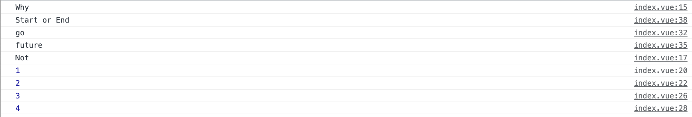

# 1、Event Loop事件循环机制

## js执行机制

js是单线程的，如果是多线程的话会引发一个问题：在同一时间同时操作DOM，一个增加一个删除，js就不知道到底该干嘛了，所以js是单线程。

随着HTML5到来，js也支持了多线程webWorker，但是也是不允许操作DOM的。

`单线程`意味着所有任务都需要排队，后面的任务需要等前面的任务执行完才能执行，如果前面的任务耗时过长，后边的任务就需要一直等，一些从用户角度上来说不需要等待的任务就需要一直等待，从用户体验上来说这是不能接受的，于是js中就出现了异步的概念。

## 同步任务

代码从上往下依次执行

## 异步任务

1. ### 宏任务

   script（整体代码）、setTimeout、setInterval、UI交互事件、postMessage、Ajax

2. ### 微任务

   Promise.then catch finally、MuationObserver、process.nextTick（Node.js环境）

运行机制

所有的同步任务都是在主进程执行的，形成一个执行栈，主进程之外还存在一个任务队列，异步任务执行队列中先执行宏任务，然后清空当前任务队列中所有微任务，然后进入下一个tick，如此形成循环。

见如下经典面试题：

```js
async function test() { // async语法糖构建一个Promise
  console.log('Why');
  await Promise.resolve() 
  console.log('Not'); // 相当于Promise.then()中执行
}
setTimeout(() => { // 宏任务
  console.log(1);
  Promise.resolve().then(() => {
    console.log(2);
  })
}, 0);
setTimeout(() => {
  console.log(3);
  Promise.resolve().then(() => {
    console.log(4);
  })
}, 0);
Promise.resolve().then(() => { // 微任务
  console.log('go');
})
Promise.resolve().then(() => {
  console.log('future');
})
test()
console.log('Start or End');
// Why Start or End Not 1 2 3 4
```

运行结果如下：



# 2、nextTick

nextTick就是创建一个异步任务，自然它得等到同步任务执行完成后再执行。

```vue
<!--
 * @Description: 
 * @Author: xiuji
 * @Date: 2022-11-20 09:14:30
 * @LastEditTime: 2023-01-10 09:20:52
 * @LastEditors: Do not edit
-->
<template>
  <div class="content">
    <input type="text" v-model="text">
    <div ref="el">{{ text }}</div>
    <button @click="change">修改</button>
  </div>
</template>

<script setup lang="ts">
import { ref,nextTick } from 'vue';
const text = ref('nextTick')
const el = ref<HTMLElement>()
console.log(el);

const change = async () => {
  text.value = 'change nextTick'
  console.log(el.value?.innerText); // 变量修改，innerText未修改
  await nextTick()
  console.log(el.value?.innerText); // 变量修改，innerText也修改

}
</script>

<style lang="scss" scoped>
.content {
  position: relative;
  flex: 1;
  height: 100%;
  margin: 20px;
  border: 1px solid #ccc;
  overflow: auto;
}
</style>
```

nextTick源码地址： core\packages\runtime-core\src\scheduler.ts

```ts
const resolvedPromise: Promise<any> = Promise.resolve()
let currentFlushPromise: Promise<void> | null = null
 
export function nextTick<T = void>(
  this: T,
  fn?: (this: T) => void
): Promise<void> {
  const p = currentFlushPromise || resolvedPromise
  return fn ? p.then(this ? fn.bind(this) : fn) : p // 一定返回一个Promise
}
```

nextTick 接受一个参数fn（函数）定义了一个变量P 这个P最终返回都是Promise，最后是return 如果传了fn 就使用变量P.then执行一个微任务去执行fn函数，then里面this如果有值就调用bind改变this指向返回新的函数，否则直接调用fn，如果没传fn，就返回一个promise，最终结果都会返回一个promise，ref源码中有一段 triggerRefValue  他会去调用 triggerEffects

```ts
export function triggerRefValue(ref: RefBase<any>, newVal?: any) {
  ref = toRaw(ref)
  if (ref.dep) {
    if (__DEV__) {
      triggerEffects(ref.dep, {
        target: ref,
        type: TriggerOpTypes.SET,
        key: 'value',
        newValue: newVal
      })
    } else {
      triggerEffects(ref.dep)
    }
  }
}
```

```ts
export function triggerEffects(
  dep: Dep | ReactiveEffect[],
  debuggerEventExtraInfo?: DebuggerEventExtraInfo
) {
  // spread into array for stabilization
  for (const effect of isArray(dep) ? dep : [...dep]) {
    if (effect !== activeEffect || effect.allowRecurse) {
      if (__DEV__ && effect.onTrigger) {
        effect.onTrigger(extend({ effect }, debuggerEventExtraInfo))
      }
      //当响应式对象发生改变后，执行 effect 如果有 scheduler 这个参数，会执行这个 scheduler 函数
      if (effect.scheduler) {
        effect.scheduler()
      } else {
        effect.run()
      }
    }
  }
}
```

scheduler函数来自类ReactiveEffect

```ts
export class ReactiveEffect<T = any> {
  active = true
  deps: Dep[] = []
  parent: ReactiveEffect | undefined = undefined

  /**
   * Can be attached after creation
   * @internal
   */
  computed?: ComputedRefImpl<T>
  /**
   * @internal
   */
  allowRecurse?: boolean

  onStop?: () => void
  // dev only
  onTrack?: (event: DebuggerEvent) => void
  // dev only
  onTrigger?: (event: DebuggerEvent) => void

  constructor(
  public fn: () => T,
   public scheduler: EffectScheduler | null = null, //我在这儿 
   scope?: EffectScope
  ) {
    recordEffectScope(this, scope)
  }
```

scheduler 作为一个参数传进来的

```ts
const effect = (instance.effect = new ReactiveEffect(
  componentUpdateFn,
  () => queueJob(instance.update),
  instance.scope // track it in component's effect scope
))
```

它是在初始化 effect 通过 queueJob 传进来的

```ts
//queueJob 维护job列队，有去重逻辑，保证任务的唯一性，每次调用去执行，被调用的时候去重，每次调用去执行 queueFlush
export function queueJob(job: SchedulerJob) {
  // 判断条件：主任务队列为空 或者 有正在执行的任务且没有在主任务队列中  && job 不能和当前正在执行任务及后面待执行任务相同
  // 重复数据删除：
  // - 使用Array.includes(Obj, startIndex) 的 起始索引参数：startIndex
  // - startIndex默认为包含当前正在运行job的index，此时，它不能再次递归触发自身
  // - 如果job是一个watch()回调函数或者当前job允许递归触发，则搜索索引将+1，以允许他递归触发自身-用户需要确保回调函数不会死循环
  if (
    (!queue.length ||
      !queue.includes(
        job,
        isFlushing && job.allowRecurse ? flushIndex + 1 : flushIndex
      )) &&
    job !== currentPreFlushParentJob
  ) {
    if (job.id == null) {
      queue.push(job)
    } else {
      queue.splice(findInsertionIndex(job.id), 0, job)
    }
    queueFlush()
  }
}
```

 queueJob 维护job列队 并且调用 queueFlush

```ts
function queueFlush() {
  // 避免重复调用flushJobs
  if (!isFlushing && !isFlushPending) {
    isFlushPending = true
     //开启异步任务处理flushJobs
    currentFlushPromise = resolvedPromise.then(flushJobs)
  }
}
```

queueFlush给每个队列创建了微任务
